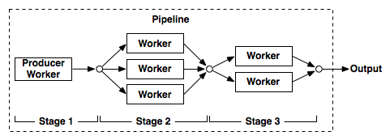

# parallelpipe

[](https://travis-ci.org/gtsystem/parallelpipe)

parallelpipe is a pipeline parallelization library for Python.

A pipeline is composed by one or more stages. Each stage take the output of the previous stage  as an input and performs some operations on it like map, filter, reduce, etc. This is an extension of the normal producer/consumer pattern where we can have multiple stages. Every stage receives the input data in a queue and push the results to another queue that is connected with the next stage. 



In this example we define a stage function that takes as an input an iterator returning urls and return the corresponding content after downloading it:

```python
from parallelpipe import stage
import requests
	
@stage(workers=4)
def fetch_urls(urls):
    for url in urls:
      	result = requests.get(url)
        yield result.content
```

To use this stage just run

```python
urls = ['http://test.com', ...]
pipe = urls | fetch_urls
for content in pipe.results():
	 print(len(content))
```

We built a basic pipe with only one stage. This stage have 4 workers that will start processing in parallel the input urls. The main process will receive the downloaded content as soon as one of them is available and print the corresponding length. Notice that a pipeline input can be any iterable; this will be automatically wrapped into a stage.

Let's say we are interested into the title string inside the HTML content. We can add another stage to do that:

```python
import re
RE_TITLE = re.compile("<title>(.*?)</title>", re.M)

@stage(workers=2)
def get_titles(contents):
    for content in contents:
        match = RE_TITLE.search(content)
        if match is not None:
            yield match.group(1)

pipe = urls | fetch_urls | get_titles
for title in pipe.results():
    print(title)
```

Again this second stage will start processing the content as soon as it is available and yield his output.
Notice that also this task is parallelized, since we set workers to 2.
As you can see this stage is not an exact map, since  the number of titles returned could be less then the number of document (we check for the presence of the title tag).

Let's add now one more stage to return the most common title:

```python
from collections import Counter

@stage()
def most_common(titles):
    commons = Counter(titles).most_common(1)
    yield commons[0]

pipe = urls | fetch_urls | get_titles | most_common
print(pipe.execute())
```

To calculate the most common title we need to aggregate all results, so we can use only one worker.
We also use ``pipe.execute()`` instead of ``pipe.results()`` because we know only one result will be returned.

### Parametrical stage

```python
@stage(workers=4)
def add_n(input, n):
	for number in input:
		 yield number + n

pipe = range(100) | add_n(7)
for result in pipe.results():
	 print(result)
```

In this example our stage function not only require the input iterator but also one or more extra parameter to perform his computation. In the moment we build our pipeline we can configure this extra paramerters simply calling the stage with them as input. Remember, all parameters can be passed except for the first one that is the mandatory input iterator.

### Mapping stage

If your stage do pure mapping, i.e. it return exactly one result for every input element you can simplify your code using the ``map_stage`` decorator:

```python
from parallelpipe import map_stage

@map_stage(workers=4)
def add_n(number, n):
	return number + n
``` 

### Queue Size

When you build a stage you can define how big his output queue is. 
Setting an output queue limit can be useful if the current stage can produce much faster then how the following stage can consume. In this case, once the queue size is reached the stage stop processing his input and wait for the consumer to free a slot.

```python
# only 30 elements can queue in output before blocking this stage
@stage(workers=4, qsize=30)
def add_n(input, n):
	for number in input:
		 yield number + n
```

By default ``qsize=0`` that means the queue have no limit.

### Setup a stage

Setup the stage queue and workers can also be done after defining the stage calling the ``setup()`` method.

```python
add_n.setup(workers=2, qsize=0)
```

### Use the Stage class directly

So far we built stages using decorators on functions, but we can also use the Stage class directly: 

```python
from parallelpipe import Stage

def add_n(input, n):
    for number in input:
         yield number + n
 
pipe = Stage(range, 10) | Stage(add_n, 5)
```

As you can see in the previous example the Stage class take as input an iterator function and any extra parameters needed by it. The first stage is a producer so will not be called with any input iterator.
When we use the stage class explictly we can use ``setup()`` to configure how many workers we need and the queue size:

```python
pipe = Stage(range, 10).setup(qsize=5) | Stage(add_n, 5).setup(workers=2)
```

The ``setup()`` method return the stage itself, so we can set it up during the pipeline definition.

### Exception handling

During the execution of your stage function an exception can occur. When a stage detects an exception it will automatically consume and ignore all the input from the previous stage and then a ``TaskException`` will be throw on the main process.

```python
@stage(workers=2)
def add_one(numbers):
    for number in numbers:
        yield number + 1
```

```python
>>> pipe = [2, 3, "ops", 7] | add_one
>>> print(sum(pipe.results()))
Process add_one-0:
Traceback (most recent call last):
  File "/Users/gt/miniconda2/lib/python2.7/multiprocessing/process.py", line 258, in _bootstrap
    self.run()
  File "/Users/gt/Desktop/code/parallelpipe/parallelpipe.py", line 67, in run
    for item in res:
  File "example.py", line 7, in add_one
    yield number + 1
TypeError: cannot concatenate 'str' and 'int' objects
Traceback (most recent call last):
  File "example.py", line 10, in <module>
    print(sum(pipe.results()))
  File "/Users/gt/Desktop/code/parallelpipe/parallelpipe.py", line 249, in results
    raise TaskException(msg)
parallelpipe.TaskException: The task "add_one-0" raised TypeError("cannot concatenate 'str' and 'int' objects",)
```

If you want to avoid that a single bad input blocks your pipeline you can of course catch any exception inside the stage function so that the pipeline can continue and produce the rest of the results.
